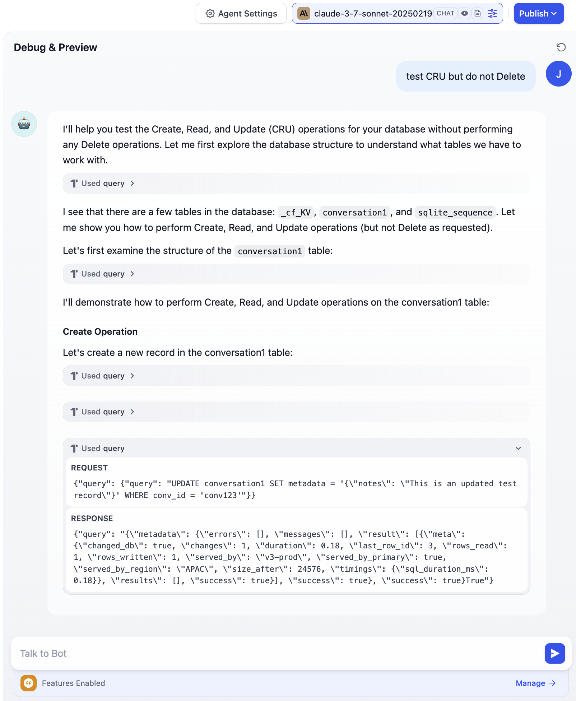

# Cloudflare D1 Data Connector for Dify

A Dify plugin that allows you to connect to Cloudflare D1 databases, execute SQL queries, and integrate database operations into your AI applications.

View more at [README](/data_connector_cloudflare_d1/README.md)

## Example (v0.0.3)

## TODO

- [x] Test in Agent mode to see if description good enough for llm
- [ ] Finish the external conversation storage and agent memory support
- [ ] Use build-in storage to store something - maybe error info, maybe something else
- [ ] Move next
